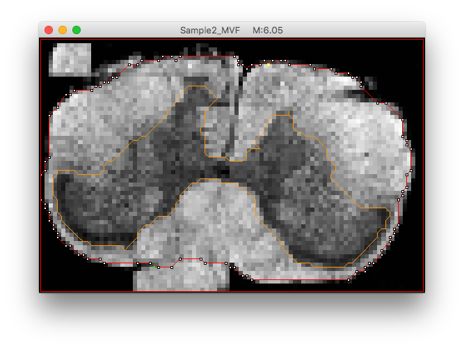
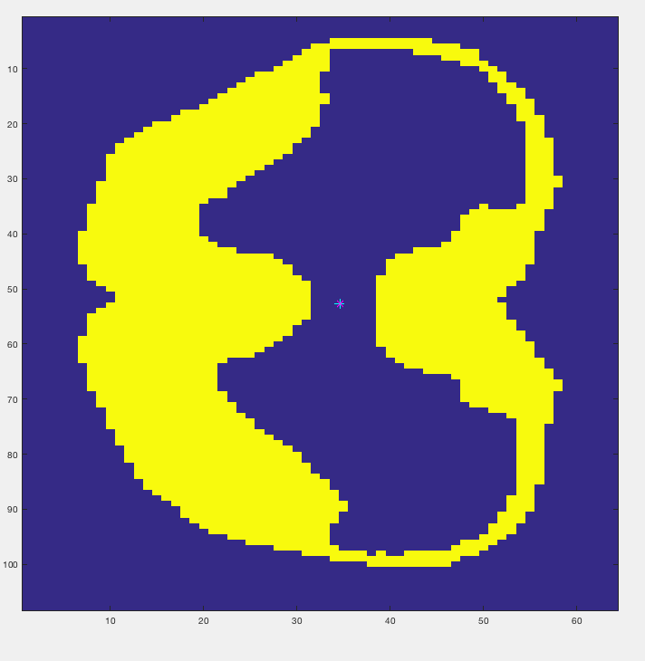
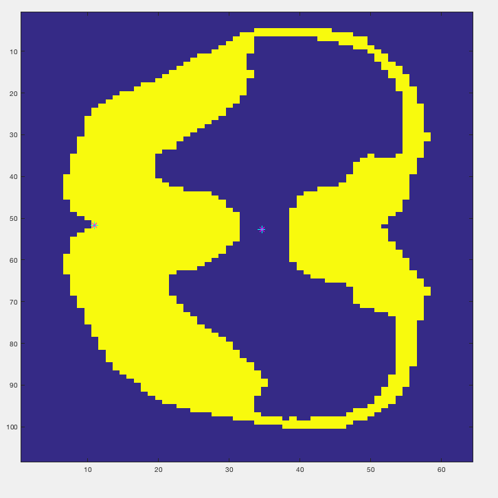
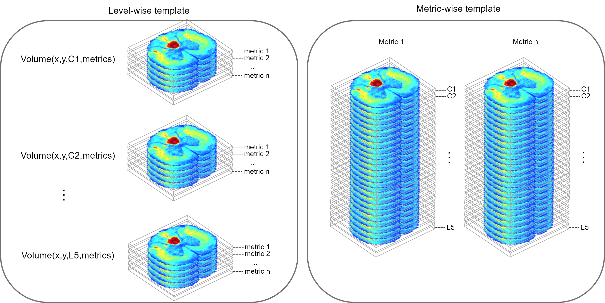

## Pipeline for generating spinal cord atlas from electron microscopy

This pipeline is designed to generate an atlas of the spinal cord based on electron microscopy images.
The output is a 4D nifti volume containing metrics obtained from scanning electron microscopy.

One slice corresponds to one spinal level: C1, C2, ... C8, T1, ...T13, L1, ... L6, S1, ... S4.

The 4th dimension contains the different metrics, in this order:
- Axon Density
- Axon Diameter
- G-Ratio
- Myelin Thickness
- Myelin Volume Fraction

## Dependencies

- [AxonSeg v3.4](https://github.com/neuropoly/axonseg/releases/tag/v3.4)
- [Spinal Cord Toolbox v3.1.1](https://github.com/neuropoly/spinalcordtoolbox/releases/tag/v3.1.1)
- [ANTs (commit 82dcdd647211004f3220e4073ea4daf06fdf89f9)](https://github.com/ANTsX/ANTs)

## Dataset available

The dataset that this pipeline is based on is available at: https://osf.io/4b69v/. It contains the following data:

- Rats perfusion + histology
- Acquisition with EM
- **Segment axon+myelin**: Using [Axonseg](https://github.com/neuropoly/axonseg). Outputs: Axon diameter, axon density, MVF, AVF, gratio, myelin thickness downsampled at 50 um maps.

The data are organized as follows:
TODO (Ariane)

```
data_rat_spinalcord_atlas/
  C1/
    Sample1/
      Sample1_AD.nii.gz
      Sample1_AED.nii.gz
      Sample1_GR.nii.gz
      Sample1_MT.nii.gz
      Sample1_MVF.nii.gz
    Sample2/
      Sample2_AD.nii.gz
      Sample2_AED.nii.gz
      Sample2_GR.nii.gz
      Sample2_MT.nii.gz
      Sample2_MVF.nii.gz
    ...
    SampleN/
      SampleN_AD.nii.gz
      SampleN_AED.nii.gz
      SampleN_GR.nii.gz
      SampleN_MT.nii.gz
      SampleN_MVF.nii.gz

  C2/
    Sample1/
      Sample1_AD.nii.gz
      Sample1_AED.nii.gz
      Sample1_GR.nii.gz
      Sample1_MT.nii.gz
      Sample1_MVF.nii.gz
    Sample2/
      Sample2_AD.nii.gz
      Sample2_AED.nii.gz
      Sample2_GR.nii.gz
      Sample2_MT.nii.gz
      Sample2_MVF.nii.gz
    ...
    SampleN/
      SampleN_AD.nii.gz
      SampleN_AED.nii.gz
      SampleN_GR.nii.gz
      SampleN_MT.nii.gz
      SampleN_MVF.nii.gz
    ...
  L5/
    ...
```

## How to run

### Installation

- open a terminal
- clone this repository:
~~~
git clone https://github.com/neuropoly/atlas-rat
~~~
- open Matlab
- add the folder of this repository to the Matlab's dir using `pathtool`

### Generate atlas

- copy the file scatlas_parameters_template.m --> scatlas_parameters.m
- adjust parameters to your setup:
~~~
edit scatlas_parameters.m
~~~

- **Create white matter masks and output referential image**:
~~~
scatlas_create_mask.m
~~~

Alternative approach (faster, but not used here):
Use [MIPAV]() > LineWireVOI. Example below:



- **Labeling**: This step is optional (labels are already included in the dataset). From the axon density map (), created labels by running:
~~~
scatlas_create_labels.m
~~~
The following labels need to be created:
  - `Label1.mat`: single point in the central canal



  - `Label2.mat`: single point in the anterior median fissure.

)

- **Transform to common space**: Estimate a 2D rigid transformation in order to put the original(axon density) maps into a common space, centered at Label #1 and oriented such that the line defined by Label #1 and Label #2 is vertical. Apply transformation to axon density map. Loop across subject and levels.
~~~
scatlas_transform_to_common_space.m
~~~

- **Linear bias correction**: Due to the limited spatial resolution, the blurry
appearance of the images induces bias in the estimation of the myelin+axon segmentation.
Based on high-resolution SEM data, we estimate the bias introduced by the
automatic axon+myelin segmentation.
~~~
scatlas_linear_bias_correction.m
~~~

- **Apply correction**: Apply the correction factors estimated in the previous
step on the MVF, AVF and g-ratio maps.
~~~
scatlas_apply_correction.m
~~~

- **Template generation**: Create average 2D template based on the WM masks, using
 antsmultivariateTemplateConstrusction2.sh. QC figures are generated at the
 root of all level folders (qc_template_*.gif).
~~~
scatlas_generate_template.m
~~~

- **Apply warping**: Apply the rigid transformation + warping fields to all metrics maps and
 generate spatial statistics (mean, STD). Note that the output volume is
 4d in shape, but the 3rd dimension (corresponding to z) is a singleton
 to anticipate future concatenation (done in later scripts).
Outputs are: `Volume4D.nii.gz` (Mean across samples) and `Volume4D_std.nii.gz`(STD).
~~~
scatlas_apply_warp.m
~~~

- **Symmetrize and clean template**: This script takes the `Volume4D.nii.gz` and `Volume4D_std.nii.gz` files of each level as inputs and (i) uses the
 left-right flips to symmetrize the output (the average is computed
 between the template and its flipped version); (ii) cleans the template
 by only keeping the spinal cord (i.e. white + gray matter) and removing
 the outer content. Outputs are: `Volume4D_sym_cleaned.nii.gz` and `Volume4D_sym_std_cleaned.nii.gz`
~~~
scatlas_symmetrize_and_clean_template.m
~~~

- **Concatenate across levels**: Concatenates the volumes (x, y, 1, metric) of each level to
 generate a 4D volume that includes all levels (x, y, z, metric). Also generates 3D
 volumes of each metric across all levels.
~~~
scatlas_concatenate_all_levels.m
~~~

### Register external atlas to the generated template

- **Digitalization of an existing atlas**: (TO FINISH)

In this example we will use the existing atlas created by Watson et al.: https://www.sciencedirect.com/science/article/pii/B9780123742476500195?via%3Dihub

This atlas is digitized and available at: https://github.com/neuropoly/atlas_rat/tree/master/digital_watson_paxinos_atlas

The step below is optional (labels are already included in the dataset).
~~~
scatlas_create_mirror_image.m
~~~

- **scatlas_atlas_fix_tract_interface.m**: In the current implementation of `scatlas_create_mirror_image`, there are issues at tract interfaces, i.e.: the tracts are summed at the interface and/or there are null pixels. This creates subsequent issues in the pipeline. This script fixes that problem by applying a median filter, which effectively removes spurious pixels at interface.

- **Register atlas to template**: (TO COPY WHEN FINALIZED)
~~~
scatlas_register_atlas_to_template.m
~~~

- **Metrics extraction**: Extract metrics within tracts defined by the atlas. 1) Creates an image showing a metric with an overlay of the atlas, where each tract is shown with a different color. 2) Extracts metrics. 3) Generate violin plot form and stats.

~~~
scatlas_extract_metrics.m
~~~

Before running the script, add to path the violin function that can be downloaded here: https://www.mathworks.com/matlabcentral/fileexchange/45134-violin-plot



ADD PIPELINE OVERVIEW FIGURE HERE


### K-means clustering

WARNING: THIS STEP IS UNDER DEVELOPMENT

Before launching the batch, the user can specify the number of clusters to use. For instance, to compute the k-means clustering for a number of clusters between 4 and 8, the following variables can be assigned:

```
min_nbr_clusters=4
max_nbr_clusters=8
```
The default values are `min_nbr_clusters=2`and `max_nbr_clusters=10`.

You can then launch the k-means batch:

```
step4_kmeans.m
```
Result figures for `k=min_nbr_clusters:max_nbr_clusters`, along with tables of means and stds of each cluster,are saved in the output folder ('Stats_X.mat', where X is the number of clusters).

### Other tools

To generate figures with colormaps for each metric from a **'Volume4D.nii.gz'** template, you can use the following script:
```
generate_metrics_figures.m
```

## Citation

If you use this work in your research, please cite it as follows:

TODO

Copyright (c) 2017 NeuroPoly (Polytechnique Montreal)

## License

The MIT License (MIT)

Copyright (c) 2017 NeuroPoly, École Polytechnique, Université de Montréal

Permission is hereby granted, free of charge, to any person obtaining a copy of this software and associated documentation files (the “Software”), to deal in the Software without restriction, including without limitation the rights to use, copy, modify, merge, publish, distribute, sublicense, and/or sell copies of the Software, and to permit persons to whom the Software is furnished to do so, subject to the following conditions:

The above copyright notice and this permission notice shall be included in all copies or substantial portions of the Software.

THE SOFTWARE IS PROVIDED “AS IS”, WITHOUT WARRANTY OF ANY KIND, EXPRESS OR IMPLIED, INCLUDING BUT NOT LIMITED TO THE WARRANTIES OF MERCHANTABILITY, FITNESS FOR A PARTICULAR PURPOSE AND NONINFRINGEMENT. IN NO EVENT SHALL THE AUTHORS OR COPYRIGHT HOLDERS BE LIABLE FOR ANY CLAIM, DAMAGES OR OTHER LIABILITY, WHETHER IN AN ACTION OF CONTRACT, TORT OR OTHERWISE, ARISING FROM, OUT OF OR IN CONNECTION WITH THE SOFTWARE OR THE USE OR OTHER DEALINGS IN THE SOFTWARE.

## Contributors

Julien Cohen-Adad, Tanguy Duval, Harris Nami, Ariane Saliani, Aldo Zaimi.
